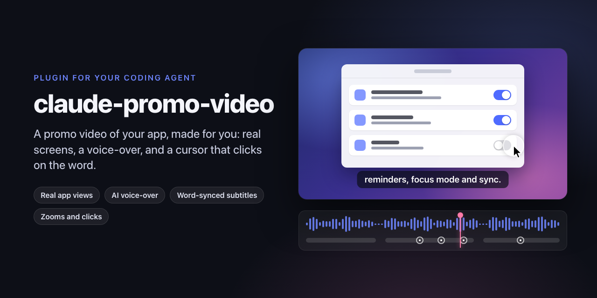

<p align="center">
  
</p>

# claude-promo-video

[](https://github.com/Iliesseu28/claude-promo-video/actions/workflows/ci.yml)
[](LICENSE)

A Claude Code plugin with one skill, `promo-video`: ask Claude for a promo video of your app and it writes the
storyboard, records a voice-over, then animates your real screens with a moving cursor, clicks, zooms and
subtitles, and renders an MP4 ready for your README, your website, social posts or an App Store app preview.

## Example video

https://github.com/user-attachments/assets/f5201cb8-1857-4e28-ada7-00c3b93f18bb

The 29-second launch video of [SimplyBar](https://github.com/Iliesseu28/SimplyBar), a free macOS menu bar app,
made with this skill. Its full source is public: [`tools/promo-video`](https://github.com/Iliesseu28/SimplyBar/tree/main/tools/promo-video).

**Measured cost**: about 15 minutes of agent time and about $3 of tokens at API prices, which a Claude subscription
covers. A full render then takes about 1 minute on a laptop.

## What it does

- **Storyboard first**: 4 to 6 gestures, one idea each, 60 to 70 words of voice, the benefit said in the first
  4 seconds.
- **Your app's real views**, not a mock-up, placed on one stage filmed by a camera that zooms and pans.
- **A voice-over** from Gemini TTS, one take per line, through Vertex AI or the Gemini API.
- **Every gesture lands on its word**: Whisper gives the time of each spoken word, and the cursor clicks on it.
- **Subtitles** in pages that follow the voice, an end card, click sounds and a soft pad, all generated.
- **One command renders** a ProRes master, normalises loudness to -16 LUFS and encodes H.264 High 4.0 with AAC
  256 kb/s, which fits Apple's app preview specifications for Mac (iPhone and iPad sizes are in the skill).
- **Deterministic**: everything depends on the frame number, so every render is identical.

## Install

In Claude Code:

```
/plugin marketplace add Iliesseu28/claude-promo-video
/plugin install promo-video@claude-promo-video
```

From a terminal, the same with `claude plugin marketplace add ...` and `claude plugin install ...`.

## Use it

Open Claude Code in your app's repository and ask, for example:

> Make a 25-second promo video of this app for the README and the App Store: show the three main features,
> with a voice-over and subtitles.

Claude loads the skill on its own when you ask for a promo, demo, trailer, launch video or app preview; you can
also call it with `/promo-video:promo-video`. It copies the template into `tools/promo-video` of your repository,
so the video lives with the app and can be rendered again after each redesign.

## What you need

| Tool | Why |
| --- | --- |
| Node 20 or later | Remotion renders the video in a headless Chrome |
| ffmpeg | final encode, loudness, checks |
| Python 3.9 or later | voice, word times, sounds (standard library only) |
| Whisper (`pipx install openai-whisper`) | the time of each spoken word |
| A Google Cloud project with Vertex AI, or a Gemini API key | the voice-over |

The voice script picks the route from your environment, and Claude asks which one you have:

| Route | Set | Model |
| --- | --- | --- |
| Vertex AI (recommended) | `GOOGLE_CLOUD_PROJECT`, and `gcloud auth login` once | `gemini-2.5-pro-tts` |
| Gemini API | `GEMINI_API_KEY` | `gemini-2.5-pro-preview-tts` |

The example video was voiced through Vertex AI; the Gemini API route follows Google's documentation. Keys stay
in your environment, never in a file.

## Inside

```
.claude-plugin/
  plugin.json             the plugin
  marketplace.json        a one-plugin marketplace, so the repository installs directly
skills/promo-video/
  SKILL.md                the rules and the 6 steps Claude follows
  references/
    tools.md              tools, versions, commands verbatim
    recipe.md             the recipe, step by step
    storyboard.md         the storyboard that worked (times, voice text, why) and a blank one
    app-store-previews.md Apple's app preview specifications (Mac, iPhone, iPad) and upload
    pitfalls.md           problems met on a real video, with cause and fix
  template/               a small Remotion project that renders as is (16 s, placeholder app)
scripts/check.py          the checks run by CI
```

The template renders a 16-second video of a placeholder app ("YourApp") out of the box: `npm ci`, then
`npm run dev` to open Remotion Studio or `bash scripts/render.sh` for the MP4. CI lints it and renders one frame on
every push.

## Credits

- [SimplyBar](https://github.com/Iliesseu28/SimplyBar) is the complete example this skill was drawn from.
- [Remotion](https://www.remotion.dev) renders the video. Remotion has its own license: free for individuals, non-profits
  and companies of up to 3 people, a paid company license beyond that. Read [remotion.dev/license](https://www.remotion.dev/license)
  before using it at work.
- Voice by Gemini TTS, word times by [Whisper](https://github.com/openai/whisper).

## License

[MIT](LICENSE), Simplibot 2026. The template's dependencies keep their own licenses.
